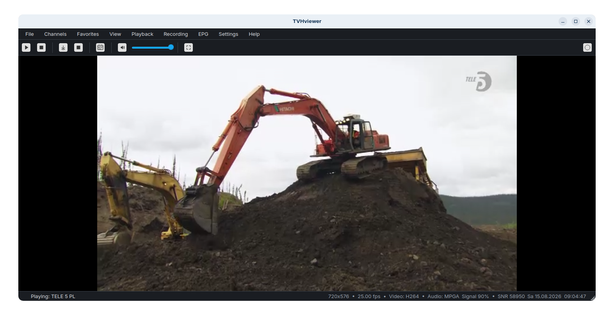

# TVHviewer

A modern desktop client for **[TVHeadend](https://tvheadend.org/)**. Easily watch, browse, and record live TV and radio directly on your PC.

TVHviewer is an independent and modernized evolution of the orginal [TVHplayer](https://github.com/mfat/tvhplayer) by mFat. It has been detached to provide ongoing updates, enhanced cross-platform support, and a completely refreshed user experience. (See NOTICE.md for full credits and a detailed changelog).




## Features

- Live TV & radio playback
- Full program guide: all channels at once, with a scrollable timeline
  view and a newspaper-style column view
- Dark / Light color theme
- Favorites menu, separate from the full channel browser
- Local recording (saves to disk via VLC/ffmpeg) with remembered save location
- Server status, tuner signal strength, and video/audio format shown
  in the status bar
- Cross-platform (Linux, Windows) — this fork has mainly been
  tested on Linux (Zorin OS / Ubuntu) and Windows 11

## Install

### Debian/Ubuntu (.deb)
Download the latest `.deb` from [Releases](../../releases) and install:
```bash
sudo apt install ./tvhviewer_*.deb
```

### Windows (built executable)
Download the latest `tvhviewer-windows.exe` from
[Releases](../../releases).
**You still need [VLC](https://www.videolan.org/vlc/) installed separately** —
the executable bundles the Python/Qt app but not the VLC engine itself
(python-vlc only provides bindings to your system's VLC installation).

### From source
```bash
git clone https://github.com/honeyx/tvhviewer.git
cd tvhviewer
python3 -m venv venv
source venv/bin/activate
pip install -r runtime-requirements.txt
pip install PyQt5
sudo apt install vlc   # native VLC library, not from pip
cd tvhplayer
python3 tvhplayer.py
```

## License

GNU General Public License v3.0 — see [LICENSE](LICENSE).
This is the same license as the original TVHplayer project.
